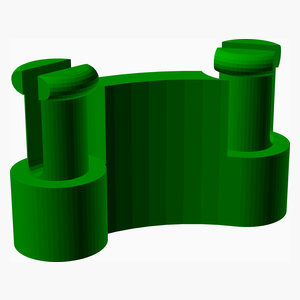
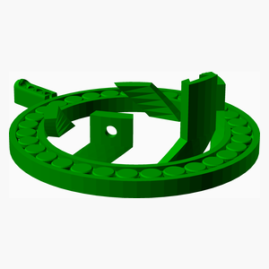
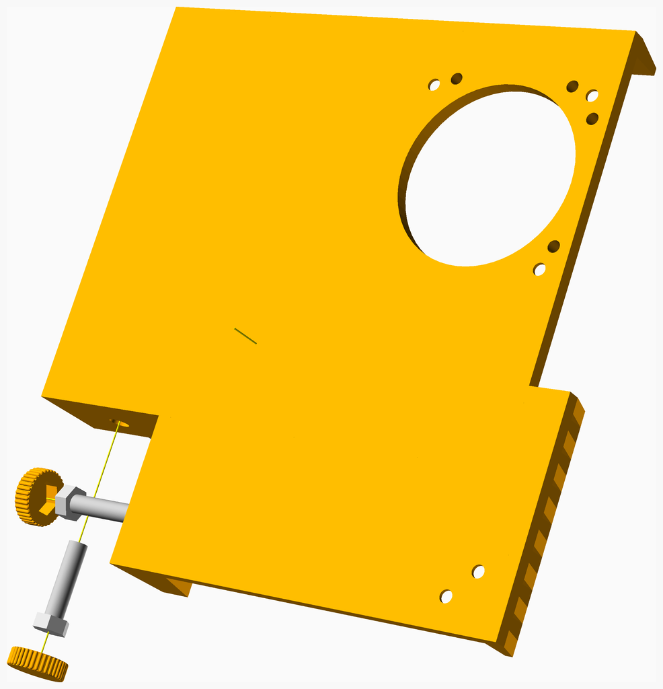
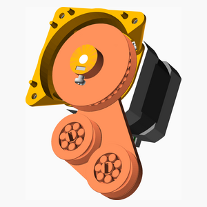
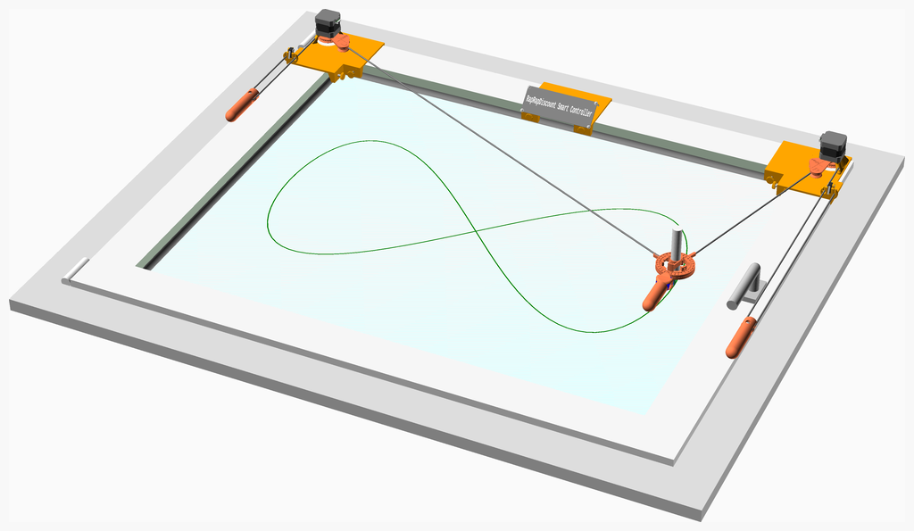

# WindowPainter

WindowPainter is a project to recycle old 3D printers.
It's a vertical plotter, to be be mounted on a window frame.

This project is still work in progress. Here is my todo list:

| Status | Task  |
|:---|:---|
| &#9989; | Setup the project |
| &#9989; | Start the design |
| &#9989; | Run the NopSCADlib flow |
| &#10060; | Complete an initial version of the design |
| &#10060; | Add assembly descriptions |
| &#10060; | Simplify the BOM |
| &#10060; | Finalize the build instructions |
| &#10060; | Build a prototype |
| &#10060; | Refine the design |
| &#10060; | Setup a project web site |
| &#9989; | Render an animated title picture |
| &#10060; | Configure/customize the Marlin firmware |
| &#10060; | Plot the first image |

---
## Table of Contents
1. [Parts list](#Parts_list)
1. [WPControllerClamp Assembly](#WPControllerClamp_assembly)
1. [WPController Assembly](#WPController_assembly)
1. [WPWeight Assembly](#WPWeight_assembly)
1. [WPGondolaLifter Assembly](#WPGondolaLifter_assembly)
1. [WPGondolaPenClampD18 Assembly](#WPGondolaPenClampD18_assembly)
1. [WPGondolaPenBearings Assembly](#WPGondolaPenBearings_assembly)
1. [WPGondola Assembly](#WPGondola_assembly)
1. [WPStepperEndstopLeft Assembly](#WPStepperEndstopLeft_assembly)
1. [WPStepperMountWithInlays Assembly](#WPStepperMountWithInlays_assembly)
1. [WPStepperMounRight Assembly](#WPStepperMounRight_assembly)
1. [WPAlignerRight Assembly](#WPAlignerRight_assembly)
1. [WPPulley Assembly](#WPPulley_assembly)
1. [WPStepperShaftRight Assembly](#WPStepperShaftRight_assembly)
1. [WPStepperClampRight Assembly](#WPStepperClampRight_assembly)
1. [WPStepperMountLeft Assembly](#WPStepperMountLeft_assembly)
1. [WPAlignerLeft Assembly](#WPAlignerLeft_assembly)
1. [WPStepperShaftLeft Assembly](#WPStepperShaftLeft_assembly)
1. [WPStepperClampLeft Assembly](#WPStepperClampLeft_assembly)
1. [Main Assembly](#main_assembly)

[Top](#TOP)

---

## Parts list
| WPControllerClamp | WPController | 2 x WPWeight | WPGondolaLifter | 2 x WPGondolaPenClampD18 | WPGondolaPenBearings | WPGondola | 2 x WPStepperEndstopLeft | WPStepperMounRight | WPAlignerRight | 2 x WPPulley | WPStepperShaftRight | 2 x WPStepperClampRight | WPStepperMountLeft | WPAlignerLeft | WPStepperShaftLeft | 2 x WPStepperClampLeft | Main | TOTALS |  |
|---:|---:|---:|---:|---:|---:|---:|---:|---:|---:|---:|---:|---:|---:|---:|---:|---:|---:|---:|:---|
|  |  |  |  |  |  |  |  |  |  |  |  |  |  |  |  |  |  | | **Vitamins** |
| &nbsp;&nbsp;.&nbsp; | &nbsp;&nbsp;.&nbsp; | &nbsp;&nbsp;.&nbsp; | &nbsp;&nbsp;.&nbsp; | &nbsp;&nbsp;.&nbsp; | &nbsp;&nbsp;.&nbsp; | &nbsp;&nbsp;.&nbsp; | &nbsp;&nbsp;.&nbsp; | &nbsp;&nbsp;.&nbsp; | &nbsp;&nbsp;.&nbsp; | &nbsp;&nbsp;.&nbsp; | &nbsp;&nbsp;.&nbsp; | &nbsp;&nbsp;.&nbsp; | &nbsp;&nbsp;.&nbsp; | &nbsp;&nbsp;.&nbsp; | &nbsp;&nbsp;.&nbsp; | &nbsp;&nbsp;.&nbsp; | &nbsp;&nbsp;1&nbsp; |  &nbsp;&nbsp;1&nbsp; | &nbsp;&nbsp; Beaded chain (diameter=3mm, spacing=4mm) |
| &nbsp;&nbsp;.&nbsp; | &nbsp;&nbsp;.&nbsp; | &nbsp;&nbsp;.&nbsp; | &nbsp;&nbsp;.&nbsp; | &nbsp;&nbsp;.&nbsp; | &nbsp;&nbsp;.&nbsp; | &nbsp;&nbsp;.&nbsp; | &nbsp;&nbsp;.&nbsp; | &nbsp;&nbsp;.&nbsp; | &nbsp;&nbsp;.&nbsp; | &nbsp;&nbsp;.&nbsp; | &nbsp;&nbsp;.&nbsp; | &nbsp;&nbsp;.&nbsp; | &nbsp;&nbsp;.&nbsp; | &nbsp;&nbsp;.&nbsp; | &nbsp;&nbsp;.&nbsp; | &nbsp;&nbsp;.&nbsp; | &nbsp;&nbsp;1&nbsp; |  &nbsp;&nbsp;1&nbsp; | &nbsp;&nbsp; Beaded chain (diameter=3mm, spacing=4mm) |
| &nbsp;&nbsp;.&nbsp; | &nbsp;&nbsp;.&nbsp; | &nbsp;&nbsp;.&nbsp; | &nbsp;&nbsp;.&nbsp; | &nbsp;&nbsp;.&nbsp; | &nbsp;&nbsp;.&nbsp; | &nbsp;&nbsp;.&nbsp; | &nbsp;&nbsp;2&nbsp; | &nbsp;&nbsp;.&nbsp; | &nbsp;&nbsp;.&nbsp; | &nbsp;&nbsp;.&nbsp; | &nbsp;&nbsp;.&nbsp; | &nbsp;&nbsp;.&nbsp; | &nbsp;&nbsp;.&nbsp; | &nbsp;&nbsp;.&nbsp; | &nbsp;&nbsp;.&nbsp; | &nbsp;&nbsp;.&nbsp; | &nbsp;&nbsp;.&nbsp; |  &nbsp;&nbsp;2&nbsp; | &nbsp;&nbsp; Microswitch SS-01 or SS-5GL |
| &nbsp;&nbsp;.&nbsp; | &nbsp;&nbsp;.&nbsp; | &nbsp;&nbsp;2&nbsp; | &nbsp;&nbsp;.&nbsp; | &nbsp;&nbsp;.&nbsp; | &nbsp;&nbsp;.&nbsp; | &nbsp;&nbsp;.&nbsp; | &nbsp;&nbsp;4&nbsp; | &nbsp;&nbsp;3&nbsp; | &nbsp;&nbsp;.&nbsp; | &nbsp;&nbsp;.&nbsp; | &nbsp;&nbsp;.&nbsp; | &nbsp;&nbsp;2&nbsp; | &nbsp;&nbsp;3&nbsp; | &nbsp;&nbsp;.&nbsp; | &nbsp;&nbsp;.&nbsp; | &nbsp;&nbsp;2&nbsp; | &nbsp;&nbsp;.&nbsp; |  &nbsp;&nbsp;16&nbsp; | &nbsp;&nbsp; Nut M3 x 2.4mm  |
| &nbsp;&nbsp;.&nbsp; | &nbsp;&nbsp;.&nbsp; | &nbsp;&nbsp;.&nbsp; | &nbsp;&nbsp;.&nbsp; | &nbsp;&nbsp;.&nbsp; | &nbsp;&nbsp;.&nbsp; | &nbsp;&nbsp;.&nbsp; | &nbsp;&nbsp;.&nbsp; | &nbsp;&nbsp;.&nbsp; | &nbsp;&nbsp;.&nbsp; | &nbsp;&nbsp;2&nbsp; | &nbsp;&nbsp;.&nbsp; | &nbsp;&nbsp;.&nbsp; | &nbsp;&nbsp;.&nbsp; | &nbsp;&nbsp;.&nbsp; | &nbsp;&nbsp;.&nbsp; | &nbsp;&nbsp;.&nbsp; | &nbsp;&nbsp;.&nbsp; |  &nbsp;&nbsp;2&nbsp; | &nbsp;&nbsp; Nut M3nS 5.5 x 1.8mm  |
| &nbsp;&nbsp;2&nbsp; | &nbsp;&nbsp;.&nbsp; | &nbsp;&nbsp;.&nbsp; | &nbsp;&nbsp;.&nbsp; | &nbsp;&nbsp;.&nbsp; | &nbsp;&nbsp;.&nbsp; | &nbsp;&nbsp;.&nbsp; | &nbsp;&nbsp;.&nbsp; | &nbsp;&nbsp;.&nbsp; | &nbsp;&nbsp;.&nbsp; | &nbsp;&nbsp;.&nbsp; | &nbsp;&nbsp;.&nbsp; | &nbsp;&nbsp;2&nbsp; | &nbsp;&nbsp;.&nbsp; | &nbsp;&nbsp;.&nbsp; | &nbsp;&nbsp;.&nbsp; | &nbsp;&nbsp;2&nbsp; | &nbsp;&nbsp;.&nbsp; |  &nbsp;&nbsp;6&nbsp; | &nbsp;&nbsp; Nut M5 x 4mm  |
| &nbsp;&nbsp;.&nbsp; | &nbsp;&nbsp;1&nbsp; | &nbsp;&nbsp;.&nbsp; | &nbsp;&nbsp;.&nbsp; | &nbsp;&nbsp;.&nbsp; | &nbsp;&nbsp;.&nbsp; | &nbsp;&nbsp;.&nbsp; | &nbsp;&nbsp;.&nbsp; | &nbsp;&nbsp;.&nbsp; | &nbsp;&nbsp;.&nbsp; | &nbsp;&nbsp;.&nbsp; | &nbsp;&nbsp;.&nbsp; | &nbsp;&nbsp;.&nbsp; | &nbsp;&nbsp;.&nbsp; | &nbsp;&nbsp;.&nbsp; | &nbsp;&nbsp;.&nbsp; | &nbsp;&nbsp;.&nbsp; | &nbsp;&nbsp;.&nbsp; |  &nbsp;&nbsp;1&nbsp; | &nbsp;&nbsp; RapRapDiscount Smart Controller |
| &nbsp;&nbsp;.&nbsp; | &nbsp;&nbsp;.&nbsp; | &nbsp;&nbsp;.&nbsp; | &nbsp;&nbsp;1&nbsp; | &nbsp;&nbsp;.&nbsp; | &nbsp;&nbsp;.&nbsp; | &nbsp;&nbsp;.&nbsp; | &nbsp;&nbsp;.&nbsp; | &nbsp;&nbsp;.&nbsp; | &nbsp;&nbsp;.&nbsp; | &nbsp;&nbsp;.&nbsp; | &nbsp;&nbsp;.&nbsp; | &nbsp;&nbsp;.&nbsp; | &nbsp;&nbsp;.&nbsp; | &nbsp;&nbsp;.&nbsp; | &nbsp;&nbsp;.&nbsp; | &nbsp;&nbsp;.&nbsp; | &nbsp;&nbsp;.&nbsp; |  &nbsp;&nbsp;1&nbsp; | &nbsp;&nbsp; SG90 servo motor |
| &nbsp;&nbsp;.&nbsp; | &nbsp;&nbsp;.&nbsp; | &nbsp;&nbsp;.&nbsp; | &nbsp;&nbsp;.&nbsp; | &nbsp;&nbsp;.&nbsp; | &nbsp;&nbsp;.&nbsp; | &nbsp;&nbsp;.&nbsp; | &nbsp;&nbsp;.&nbsp; | &nbsp;&nbsp;.&nbsp; | &nbsp;&nbsp;.&nbsp; | &nbsp;&nbsp;.&nbsp; | &nbsp;&nbsp;.&nbsp; | &nbsp;&nbsp;2&nbsp; | &nbsp;&nbsp;.&nbsp; | &nbsp;&nbsp;.&nbsp; | &nbsp;&nbsp;.&nbsp; | &nbsp;&nbsp;2&nbsp; | &nbsp;&nbsp;.&nbsp; |  &nbsp;&nbsp;4&nbsp; | &nbsp;&nbsp; Screw M3 dome x  8mm |
| &nbsp;&nbsp;.&nbsp; | &nbsp;&nbsp;.&nbsp; | &nbsp;&nbsp;.&nbsp; | &nbsp;&nbsp;.&nbsp; | &nbsp;&nbsp;.&nbsp; | &nbsp;&nbsp;.&nbsp; | &nbsp;&nbsp;.&nbsp; | &nbsp;&nbsp;.&nbsp; | &nbsp;&nbsp;.&nbsp; | &nbsp;&nbsp;.&nbsp; | &nbsp;&nbsp;.&nbsp; | &nbsp;&nbsp;.&nbsp; | &nbsp;&nbsp;3&nbsp; | &nbsp;&nbsp;.&nbsp; | &nbsp;&nbsp;.&nbsp; | &nbsp;&nbsp;.&nbsp; | &nbsp;&nbsp;3&nbsp; | &nbsp;&nbsp;.&nbsp; |  &nbsp;&nbsp;6&nbsp; | &nbsp;&nbsp; Screw M3 dome x 10mm |
| &nbsp;&nbsp;.&nbsp; | &nbsp;&nbsp;.&nbsp; | &nbsp;&nbsp;.&nbsp; | &nbsp;&nbsp;.&nbsp; | &nbsp;&nbsp;.&nbsp; | &nbsp;&nbsp;.&nbsp; | &nbsp;&nbsp;.&nbsp; | &nbsp;&nbsp;4&nbsp; | &nbsp;&nbsp;.&nbsp; | &nbsp;&nbsp;.&nbsp; | &nbsp;&nbsp;.&nbsp; | &nbsp;&nbsp;.&nbsp; | &nbsp;&nbsp;.&nbsp; | &nbsp;&nbsp;.&nbsp; | &nbsp;&nbsp;.&nbsp; | &nbsp;&nbsp;.&nbsp; | &nbsp;&nbsp;.&nbsp; | &nbsp;&nbsp;.&nbsp; |  &nbsp;&nbsp;4&nbsp; | &nbsp;&nbsp; Screw M3 dome x 12mm |
| &nbsp;&nbsp;.&nbsp; | &nbsp;&nbsp;4&nbsp; | &nbsp;&nbsp;2&nbsp; | &nbsp;&nbsp;.&nbsp; | &nbsp;&nbsp;.&nbsp; | &nbsp;&nbsp;.&nbsp; | &nbsp;&nbsp;.&nbsp; | &nbsp;&nbsp;.&nbsp; | &nbsp;&nbsp;.&nbsp; | &nbsp;&nbsp;.&nbsp; | &nbsp;&nbsp;.&nbsp; | &nbsp;&nbsp;.&nbsp; | &nbsp;&nbsp;.&nbsp; | &nbsp;&nbsp;.&nbsp; | &nbsp;&nbsp;.&nbsp; | &nbsp;&nbsp;.&nbsp; | &nbsp;&nbsp;.&nbsp; | &nbsp;&nbsp;.&nbsp; |  &nbsp;&nbsp;6&nbsp; | &nbsp;&nbsp; Screw M3 dome x 20mm |
| &nbsp;&nbsp;.&nbsp; | &nbsp;&nbsp;.&nbsp; | &nbsp;&nbsp;.&nbsp; | &nbsp;&nbsp;.&nbsp; | &nbsp;&nbsp;.&nbsp; | &nbsp;&nbsp;.&nbsp; | &nbsp;&nbsp;.&nbsp; | &nbsp;&nbsp;.&nbsp; | &nbsp;&nbsp;3&nbsp; | &nbsp;&nbsp;.&nbsp; | &nbsp;&nbsp;2&nbsp; | &nbsp;&nbsp;.&nbsp; | &nbsp;&nbsp;.&nbsp; | &nbsp;&nbsp;3&nbsp; | &nbsp;&nbsp;.&nbsp; | &nbsp;&nbsp;.&nbsp; | &nbsp;&nbsp;.&nbsp; | &nbsp;&nbsp;.&nbsp; |  &nbsp;&nbsp;8&nbsp; | &nbsp;&nbsp; Screw M3 pan x  8mm |
| &nbsp;&nbsp;2&nbsp; | &nbsp;&nbsp;.&nbsp; | &nbsp;&nbsp;.&nbsp; | &nbsp;&nbsp;.&nbsp; | &nbsp;&nbsp;.&nbsp; | &nbsp;&nbsp;.&nbsp; | &nbsp;&nbsp;.&nbsp; | &nbsp;&nbsp;.&nbsp; | &nbsp;&nbsp;.&nbsp; | &nbsp;&nbsp;.&nbsp; | &nbsp;&nbsp;.&nbsp; | &nbsp;&nbsp;.&nbsp; | &nbsp;&nbsp;2&nbsp; | &nbsp;&nbsp;.&nbsp; | &nbsp;&nbsp;.&nbsp; | &nbsp;&nbsp;.&nbsp; | &nbsp;&nbsp;2&nbsp; | &nbsp;&nbsp;.&nbsp; |  &nbsp;&nbsp;6&nbsp; | &nbsp;&nbsp; Screw M5 hex x 20mm |
| &nbsp;&nbsp;.&nbsp; | &nbsp;&nbsp;.&nbsp; | &nbsp;&nbsp;.&nbsp; | &nbsp;&nbsp;.&nbsp; | &nbsp;&nbsp;.&nbsp; | &nbsp;&nbsp;.&nbsp; | &nbsp;&nbsp;.&nbsp; | &nbsp;&nbsp;.&nbsp; | &nbsp;&nbsp;1&nbsp; | &nbsp;&nbsp;.&nbsp; | &nbsp;&nbsp;.&nbsp; | &nbsp;&nbsp;.&nbsp; | &nbsp;&nbsp;.&nbsp; | &nbsp;&nbsp;1&nbsp; | &nbsp;&nbsp;.&nbsp; | &nbsp;&nbsp;.&nbsp; | &nbsp;&nbsp;.&nbsp; | &nbsp;&nbsp;.&nbsp; |  &nbsp;&nbsp;2&nbsp; | &nbsp;&nbsp; Stepper motor NEMA17 x 40mm |
| &nbsp;&nbsp;.&nbsp; | &nbsp;&nbsp;4&nbsp; | &nbsp;&nbsp;2&nbsp; | &nbsp;&nbsp;.&nbsp; | &nbsp;&nbsp;.&nbsp; | &nbsp;&nbsp;.&nbsp; | &nbsp;&nbsp;.&nbsp; | &nbsp;&nbsp;4&nbsp; | &nbsp;&nbsp;3&nbsp; | &nbsp;&nbsp;.&nbsp; | &nbsp;&nbsp;.&nbsp; | &nbsp;&nbsp;.&nbsp; | &nbsp;&nbsp;5&nbsp; | &nbsp;&nbsp;3&nbsp; | &nbsp;&nbsp;.&nbsp; | &nbsp;&nbsp;.&nbsp; | &nbsp;&nbsp;5&nbsp; | &nbsp;&nbsp;.&nbsp; |  &nbsp;&nbsp;26&nbsp; | &nbsp;&nbsp; Washer  M3 x 7mm x 0.5mm |
| &nbsp;&nbsp;.&nbsp; | &nbsp;&nbsp;.&nbsp; | &nbsp;&nbsp;.&nbsp; | &nbsp;&nbsp;.&nbsp; | &nbsp;&nbsp;.&nbsp; | &nbsp;&nbsp;.&nbsp; | &nbsp;&nbsp;.&nbsp; | &nbsp;&nbsp;.&nbsp; | &nbsp;&nbsp;3&nbsp; | &nbsp;&nbsp;.&nbsp; | &nbsp;&nbsp;.&nbsp; | &nbsp;&nbsp;.&nbsp; | &nbsp;&nbsp;.&nbsp; | &nbsp;&nbsp;3&nbsp; | &nbsp;&nbsp;.&nbsp; | &nbsp;&nbsp;.&nbsp; | &nbsp;&nbsp;.&nbsp; | &nbsp;&nbsp;.&nbsp; |  &nbsp;&nbsp;6&nbsp; | &nbsp;&nbsp; Washer star M3 x 0.5mm |
| &nbsp;&nbsp;.&nbsp; | &nbsp;&nbsp;.&nbsp; | &nbsp;&nbsp;.&nbsp; | &nbsp;&nbsp;.&nbsp; | &nbsp;&nbsp;.&nbsp; | &nbsp;&nbsp;.&nbsp; | &nbsp;&nbsp;1&nbsp; | &nbsp;&nbsp;.&nbsp; | &nbsp;&nbsp;.&nbsp; | &nbsp;&nbsp;.&nbsp; | &nbsp;&nbsp;.&nbsp; | &nbsp;&nbsp;.&nbsp; | &nbsp;&nbsp;.&nbsp; | &nbsp;&nbsp;.&nbsp; | &nbsp;&nbsp;.&nbsp; | &nbsp;&nbsp;.&nbsp; | &nbsp;&nbsp;.&nbsp; | &nbsp;&nbsp;.&nbsp; |  &nbsp;&nbsp;1&nbsp; | &nbsp;&nbsp; Window pen |
| &nbsp;&nbsp;4&nbsp; | &nbsp;&nbsp;9&nbsp; | &nbsp;&nbsp;6&nbsp; | &nbsp;&nbsp;1&nbsp; | &nbsp;&nbsp;.&nbsp; | &nbsp;&nbsp;.&nbsp; | &nbsp;&nbsp;1&nbsp; | &nbsp;&nbsp;14&nbsp; | &nbsp;&nbsp;13&nbsp; | &nbsp;&nbsp;.&nbsp; | &nbsp;&nbsp;4&nbsp; | &nbsp;&nbsp;.&nbsp; | &nbsp;&nbsp;16&nbsp; | &nbsp;&nbsp;13&nbsp; | &nbsp;&nbsp;.&nbsp; | &nbsp;&nbsp;.&nbsp; | &nbsp;&nbsp;16&nbsp; | &nbsp;&nbsp;2&nbsp; | &nbsp;&nbsp;99&nbsp; | &nbsp;&nbsp;Total vitamins count |
|  |  |  |  |  |  |  |  |  |  |  |  |  |  |  |  |  |  | | **3D printed parts** |
| &nbsp;&nbsp;.&nbsp; | &nbsp;&nbsp;.&nbsp; | &nbsp;&nbsp;.&nbsp; | &nbsp;&nbsp;.&nbsp; | &nbsp;&nbsp;.&nbsp; | &nbsp;&nbsp;.&nbsp; | &nbsp;&nbsp;.&nbsp; | &nbsp;&nbsp;.&nbsp; | &nbsp;&nbsp;.&nbsp; | &nbsp;&nbsp;2&nbsp; | &nbsp;&nbsp;.&nbsp; | &nbsp;&nbsp;.&nbsp; | &nbsp;&nbsp;.&nbsp; | &nbsp;&nbsp;.&nbsp; | &nbsp;&nbsp;2&nbsp; | &nbsp;&nbsp;.&nbsp; | &nbsp;&nbsp;.&nbsp; | &nbsp;&nbsp;.&nbsp; |  &nbsp;&nbsp;4&nbsp; | &nbsp;&nbsp;WPAlignerIdler.stl |
| &nbsp;&nbsp;.&nbsp; | &nbsp;&nbsp;.&nbsp; | &nbsp;&nbsp;.&nbsp; | &nbsp;&nbsp;.&nbsp; | &nbsp;&nbsp;.&nbsp; | &nbsp;&nbsp;.&nbsp; | &nbsp;&nbsp;.&nbsp; | &nbsp;&nbsp;.&nbsp; | &nbsp;&nbsp;.&nbsp; | &nbsp;&nbsp;.&nbsp; | &nbsp;&nbsp;.&nbsp; | &nbsp;&nbsp;.&nbsp; | &nbsp;&nbsp;.&nbsp; | &nbsp;&nbsp;.&nbsp; | &nbsp;&nbsp;1&nbsp; | &nbsp;&nbsp;.&nbsp; | &nbsp;&nbsp;.&nbsp; | &nbsp;&nbsp;.&nbsp; |  &nbsp;&nbsp;1&nbsp; | &nbsp;&nbsp;WPAlignerLeft.stl |
| &nbsp;&nbsp;.&nbsp; | &nbsp;&nbsp;.&nbsp; | &nbsp;&nbsp;.&nbsp; | &nbsp;&nbsp;.&nbsp; | &nbsp;&nbsp;.&nbsp; | &nbsp;&nbsp;.&nbsp; | &nbsp;&nbsp;.&nbsp; | &nbsp;&nbsp;.&nbsp; | &nbsp;&nbsp;.&nbsp; | &nbsp;&nbsp;1&nbsp; | &nbsp;&nbsp;.&nbsp; | &nbsp;&nbsp;.&nbsp; | &nbsp;&nbsp;.&nbsp; | &nbsp;&nbsp;.&nbsp; | &nbsp;&nbsp;.&nbsp; | &nbsp;&nbsp;.&nbsp; | &nbsp;&nbsp;.&nbsp; | &nbsp;&nbsp;.&nbsp; |  &nbsp;&nbsp;1&nbsp; | &nbsp;&nbsp;WPAlignerRight.stl |
| &nbsp;&nbsp;2&nbsp; | &nbsp;&nbsp;.&nbsp; | &nbsp;&nbsp;.&nbsp; | &nbsp;&nbsp;.&nbsp; | &nbsp;&nbsp;.&nbsp; | &nbsp;&nbsp;.&nbsp; | &nbsp;&nbsp;.&nbsp; | &nbsp;&nbsp;.&nbsp; | &nbsp;&nbsp;.&nbsp; | &nbsp;&nbsp;.&nbsp; | &nbsp;&nbsp;.&nbsp; | &nbsp;&nbsp;.&nbsp; | &nbsp;&nbsp;2&nbsp; | &nbsp;&nbsp;.&nbsp; | &nbsp;&nbsp;.&nbsp; | &nbsp;&nbsp;.&nbsp; | &nbsp;&nbsp;2&nbsp; | &nbsp;&nbsp;.&nbsp; |  &nbsp;&nbsp;6&nbsp; | &nbsp;&nbsp;WPClampScrewGrip.stl |
| &nbsp;&nbsp;2&nbsp; | &nbsp;&nbsp;.&nbsp; | &nbsp;&nbsp;.&nbsp; | &nbsp;&nbsp;.&nbsp; | &nbsp;&nbsp;.&nbsp; | &nbsp;&nbsp;.&nbsp; | &nbsp;&nbsp;.&nbsp; | &nbsp;&nbsp;.&nbsp; | &nbsp;&nbsp;.&nbsp; | &nbsp;&nbsp;.&nbsp; | &nbsp;&nbsp;.&nbsp; | &nbsp;&nbsp;.&nbsp; | &nbsp;&nbsp;2&nbsp; | &nbsp;&nbsp;.&nbsp; | &nbsp;&nbsp;.&nbsp; | &nbsp;&nbsp;.&nbsp; | &nbsp;&nbsp;2&nbsp; | &nbsp;&nbsp;.&nbsp; |  &nbsp;&nbsp;6&nbsp; | &nbsp;&nbsp;WPClampScrewShoe.stl |
| &nbsp;&nbsp;1&nbsp; | &nbsp;&nbsp;.&nbsp; | &nbsp;&nbsp;.&nbsp; | &nbsp;&nbsp;.&nbsp; | &nbsp;&nbsp;.&nbsp; | &nbsp;&nbsp;.&nbsp; | &nbsp;&nbsp;.&nbsp; | &nbsp;&nbsp;.&nbsp; | &nbsp;&nbsp;.&nbsp; | &nbsp;&nbsp;.&nbsp; | &nbsp;&nbsp;.&nbsp; | &nbsp;&nbsp;.&nbsp; | &nbsp;&nbsp;.&nbsp; | &nbsp;&nbsp;.&nbsp; | &nbsp;&nbsp;.&nbsp; | &nbsp;&nbsp;.&nbsp; | &nbsp;&nbsp;.&nbsp; | &nbsp;&nbsp;.&nbsp; |  &nbsp;&nbsp;1&nbsp; | &nbsp;&nbsp;WPControllerClamp.stl |
| &nbsp;&nbsp;.&nbsp; | &nbsp;&nbsp;.&nbsp; | &nbsp;&nbsp;.&nbsp; | &nbsp;&nbsp;.&nbsp; | &nbsp;&nbsp;.&nbsp; | &nbsp;&nbsp;2&nbsp; | &nbsp;&nbsp;.&nbsp; | &nbsp;&nbsp;.&nbsp; | &nbsp;&nbsp;.&nbsp; | &nbsp;&nbsp;.&nbsp; | &nbsp;&nbsp;.&nbsp; | &nbsp;&nbsp;.&nbsp; | &nbsp;&nbsp;.&nbsp; | &nbsp;&nbsp;.&nbsp; | &nbsp;&nbsp;.&nbsp; | &nbsp;&nbsp;.&nbsp; | &nbsp;&nbsp;.&nbsp; | &nbsp;&nbsp;.&nbsp; |  &nbsp;&nbsp;2&nbsp; | &nbsp;&nbsp;WPGondolaBearing.stl |
| &nbsp;&nbsp;.&nbsp; | &nbsp;&nbsp;.&nbsp; | &nbsp;&nbsp;.&nbsp; | &nbsp;&nbsp;.&nbsp; | &nbsp;&nbsp;2&nbsp; | &nbsp;&nbsp;.&nbsp; | &nbsp;&nbsp;.&nbsp; | &nbsp;&nbsp;.&nbsp; | &nbsp;&nbsp;.&nbsp; | &nbsp;&nbsp;.&nbsp; | &nbsp;&nbsp;.&nbsp; | &nbsp;&nbsp;.&nbsp; | &nbsp;&nbsp;.&nbsp; | &nbsp;&nbsp;.&nbsp; | &nbsp;&nbsp;.&nbsp; | &nbsp;&nbsp;.&nbsp; | &nbsp;&nbsp;.&nbsp; | &nbsp;&nbsp;.&nbsp; |  &nbsp;&nbsp;2&nbsp; | &nbsp;&nbsp;WPGondolaPenClampD18Part1.stl |
| &nbsp;&nbsp;.&nbsp; | &nbsp;&nbsp;.&nbsp; | &nbsp;&nbsp;.&nbsp; | &nbsp;&nbsp;.&nbsp; | &nbsp;&nbsp;2&nbsp; | &nbsp;&nbsp;.&nbsp; | &nbsp;&nbsp;.&nbsp; | &nbsp;&nbsp;.&nbsp; | &nbsp;&nbsp;.&nbsp; | &nbsp;&nbsp;.&nbsp; | &nbsp;&nbsp;.&nbsp; | &nbsp;&nbsp;.&nbsp; | &nbsp;&nbsp;.&nbsp; | &nbsp;&nbsp;.&nbsp; | &nbsp;&nbsp;.&nbsp; | &nbsp;&nbsp;.&nbsp; | &nbsp;&nbsp;.&nbsp; | &nbsp;&nbsp;.&nbsp; |  &nbsp;&nbsp;2&nbsp; | &nbsp;&nbsp;WPGondolaPenClampD18Part2.stl |
| &nbsp;&nbsp;.&nbsp; | &nbsp;&nbsp;.&nbsp; | &nbsp;&nbsp;.&nbsp; | &nbsp;&nbsp;.&nbsp; | &nbsp;&nbsp;2&nbsp; | &nbsp;&nbsp;.&nbsp; | &nbsp;&nbsp;.&nbsp; | &nbsp;&nbsp;.&nbsp; | &nbsp;&nbsp;.&nbsp; | &nbsp;&nbsp;.&nbsp; | &nbsp;&nbsp;.&nbsp; | &nbsp;&nbsp;.&nbsp; | &nbsp;&nbsp;.&nbsp; | &nbsp;&nbsp;.&nbsp; | &nbsp;&nbsp;.&nbsp; | &nbsp;&nbsp;.&nbsp; | &nbsp;&nbsp;.&nbsp; | &nbsp;&nbsp;.&nbsp; |  &nbsp;&nbsp;2&nbsp; | &nbsp;&nbsp;WPGondolaPenClampD18Part3.stl |
| &nbsp;&nbsp;.&nbsp; | &nbsp;&nbsp;.&nbsp; | &nbsp;&nbsp;.&nbsp; | &nbsp;&nbsp;.&nbsp; | &nbsp;&nbsp;2&nbsp; | &nbsp;&nbsp;.&nbsp; | &nbsp;&nbsp;.&nbsp; | &nbsp;&nbsp;.&nbsp; | &nbsp;&nbsp;.&nbsp; | &nbsp;&nbsp;.&nbsp; | &nbsp;&nbsp;.&nbsp; | &nbsp;&nbsp;.&nbsp; | &nbsp;&nbsp;.&nbsp; | &nbsp;&nbsp;.&nbsp; | &nbsp;&nbsp;.&nbsp; | &nbsp;&nbsp;.&nbsp; | &nbsp;&nbsp;.&nbsp; | &nbsp;&nbsp;.&nbsp; |  &nbsp;&nbsp;2&nbsp; | &nbsp;&nbsp;WPGondolaPenClampD18Part4.stl |
| &nbsp;&nbsp;.&nbsp; | &nbsp;&nbsp;.&nbsp; | &nbsp;&nbsp;.&nbsp; | &nbsp;&nbsp;.&nbsp; | &nbsp;&nbsp;.&nbsp; | &nbsp;&nbsp;.&nbsp; | &nbsp;&nbsp;.&nbsp; | &nbsp;&nbsp;.&nbsp; | &nbsp;&nbsp;.&nbsp; | &nbsp;&nbsp;.&nbsp; | &nbsp;&nbsp;2&nbsp; | &nbsp;&nbsp;.&nbsp; | &nbsp;&nbsp;.&nbsp; | &nbsp;&nbsp;.&nbsp; | &nbsp;&nbsp;.&nbsp; | &nbsp;&nbsp;.&nbsp; | &nbsp;&nbsp;.&nbsp; | &nbsp;&nbsp;.&nbsp; |  &nbsp;&nbsp;2&nbsp; | &nbsp;&nbsp;WPPulley.stl |
| &nbsp;&nbsp;.&nbsp; | &nbsp;&nbsp;.&nbsp; | &nbsp;&nbsp;.&nbsp; | &nbsp;&nbsp;1&nbsp; | &nbsp;&nbsp;.&nbsp; | &nbsp;&nbsp;.&nbsp; | &nbsp;&nbsp;.&nbsp; | &nbsp;&nbsp;.&nbsp; | &nbsp;&nbsp;.&nbsp; | &nbsp;&nbsp;.&nbsp; | &nbsp;&nbsp;.&nbsp; | &nbsp;&nbsp;.&nbsp; | &nbsp;&nbsp;.&nbsp; | &nbsp;&nbsp;.&nbsp; | &nbsp;&nbsp;.&nbsp; | &nbsp;&nbsp;.&nbsp; | &nbsp;&nbsp;.&nbsp; | &nbsp;&nbsp;.&nbsp; |  &nbsp;&nbsp;1&nbsp; | &nbsp;&nbsp;WPServoGear.stl |
| &nbsp;&nbsp;.&nbsp; | &nbsp;&nbsp;.&nbsp; | &nbsp;&nbsp;.&nbsp; | &nbsp;&nbsp;1&nbsp; | &nbsp;&nbsp;.&nbsp; | &nbsp;&nbsp;.&nbsp; | &nbsp;&nbsp;.&nbsp; | &nbsp;&nbsp;.&nbsp; | &nbsp;&nbsp;.&nbsp; | &nbsp;&nbsp;.&nbsp; | &nbsp;&nbsp;.&nbsp; | &nbsp;&nbsp;.&nbsp; | &nbsp;&nbsp;.&nbsp; | &nbsp;&nbsp;.&nbsp; | &nbsp;&nbsp;.&nbsp; | &nbsp;&nbsp;.&nbsp; | &nbsp;&nbsp;.&nbsp; | &nbsp;&nbsp;.&nbsp; |  &nbsp;&nbsp;1&nbsp; | &nbsp;&nbsp;WPServoLifter.stl |
| &nbsp;&nbsp;.&nbsp; | &nbsp;&nbsp;.&nbsp; | &nbsp;&nbsp;.&nbsp; | &nbsp;&nbsp;.&nbsp; | &nbsp;&nbsp;.&nbsp; | &nbsp;&nbsp;.&nbsp; | &nbsp;&nbsp;.&nbsp; | &nbsp;&nbsp;.&nbsp; | &nbsp;&nbsp;.&nbsp; | &nbsp;&nbsp;.&nbsp; | &nbsp;&nbsp;.&nbsp; | &nbsp;&nbsp;.&nbsp; | &nbsp;&nbsp;.&nbsp; | &nbsp;&nbsp;.&nbsp; | &nbsp;&nbsp;.&nbsp; | &nbsp;&nbsp;.&nbsp; | &nbsp;&nbsp;1&nbsp; | &nbsp;&nbsp;.&nbsp; |  &nbsp;&nbsp;1&nbsp; | &nbsp;&nbsp;WPStepperClampLeft.stl |
| &nbsp;&nbsp;.&nbsp; | &nbsp;&nbsp;.&nbsp; | &nbsp;&nbsp;.&nbsp; | &nbsp;&nbsp;.&nbsp; | &nbsp;&nbsp;.&nbsp; | &nbsp;&nbsp;.&nbsp; | &nbsp;&nbsp;.&nbsp; | &nbsp;&nbsp;.&nbsp; | &nbsp;&nbsp;.&nbsp; | &nbsp;&nbsp;.&nbsp; | &nbsp;&nbsp;.&nbsp; | &nbsp;&nbsp;.&nbsp; | &nbsp;&nbsp;1&nbsp; | &nbsp;&nbsp;.&nbsp; | &nbsp;&nbsp;.&nbsp; | &nbsp;&nbsp;.&nbsp; | &nbsp;&nbsp;.&nbsp; | &nbsp;&nbsp;.&nbsp; |  &nbsp;&nbsp;1&nbsp; | &nbsp;&nbsp;WPStepperClampRight.stl |
| &nbsp;&nbsp;.&nbsp; | &nbsp;&nbsp;.&nbsp; | &nbsp;&nbsp;.&nbsp; | &nbsp;&nbsp;.&nbsp; | &nbsp;&nbsp;.&nbsp; | &nbsp;&nbsp;.&nbsp; | &nbsp;&nbsp;.&nbsp; | &nbsp;&nbsp;1&nbsp; | &nbsp;&nbsp;.&nbsp; | &nbsp;&nbsp;.&nbsp; | &nbsp;&nbsp;.&nbsp; | &nbsp;&nbsp;.&nbsp; | &nbsp;&nbsp;.&nbsp; | &nbsp;&nbsp;.&nbsp; | &nbsp;&nbsp;.&nbsp; | &nbsp;&nbsp;.&nbsp; | &nbsp;&nbsp;.&nbsp; | &nbsp;&nbsp;.&nbsp; |  &nbsp;&nbsp;1&nbsp; | &nbsp;&nbsp;WPStepperEndstopLeft.stl |
| &nbsp;&nbsp;.&nbsp; | &nbsp;&nbsp;.&nbsp; | &nbsp;&nbsp;.&nbsp; | &nbsp;&nbsp;.&nbsp; | &nbsp;&nbsp;.&nbsp; | &nbsp;&nbsp;.&nbsp; | &nbsp;&nbsp;.&nbsp; | &nbsp;&nbsp;1&nbsp; | &nbsp;&nbsp;.&nbsp; | &nbsp;&nbsp;.&nbsp; | &nbsp;&nbsp;.&nbsp; | &nbsp;&nbsp;.&nbsp; | &nbsp;&nbsp;.&nbsp; | &nbsp;&nbsp;.&nbsp; | &nbsp;&nbsp;.&nbsp; | &nbsp;&nbsp;.&nbsp; | &nbsp;&nbsp;.&nbsp; | &nbsp;&nbsp;.&nbsp; |  &nbsp;&nbsp;1&nbsp; | &nbsp;&nbsp;WPStepperEndstopRight.stl |
| &nbsp;&nbsp;.&nbsp; | &nbsp;&nbsp;.&nbsp; | &nbsp;&nbsp;.&nbsp; | &nbsp;&nbsp;.&nbsp; | &nbsp;&nbsp;.&nbsp; | &nbsp;&nbsp;.&nbsp; | &nbsp;&nbsp;.&nbsp; | &nbsp;&nbsp;.&nbsp; | &nbsp;&nbsp;1&nbsp; | &nbsp;&nbsp;.&nbsp; | &nbsp;&nbsp;.&nbsp; | &nbsp;&nbsp;.&nbsp; | &nbsp;&nbsp;.&nbsp; | &nbsp;&nbsp;1&nbsp; | &nbsp;&nbsp;.&nbsp; | &nbsp;&nbsp;.&nbsp; | &nbsp;&nbsp;.&nbsp; | &nbsp;&nbsp;.&nbsp; |  &nbsp;&nbsp;2&nbsp; | &nbsp;&nbsp;WPStepperMountWithInlays.stl |
| &nbsp;&nbsp;.&nbsp; | &nbsp;&nbsp;.&nbsp; | &nbsp;&nbsp;2&nbsp; | &nbsp;&nbsp;1&nbsp; | &nbsp;&nbsp;.&nbsp; | &nbsp;&nbsp;.&nbsp; | &nbsp;&nbsp;.&nbsp; | &nbsp;&nbsp;.&nbsp; | &nbsp;&nbsp;.&nbsp; | &nbsp;&nbsp;.&nbsp; | &nbsp;&nbsp;.&nbsp; | &nbsp;&nbsp;.&nbsp; | &nbsp;&nbsp;.&nbsp; | &nbsp;&nbsp;.&nbsp; | &nbsp;&nbsp;.&nbsp; | &nbsp;&nbsp;.&nbsp; | &nbsp;&nbsp;.&nbsp; | &nbsp;&nbsp;.&nbsp; |  &nbsp;&nbsp;3&nbsp; | &nbsp;&nbsp;WPWeightBottom.stl |
| &nbsp;&nbsp;.&nbsp; | &nbsp;&nbsp;.&nbsp; | &nbsp;&nbsp;2&nbsp; | &nbsp;&nbsp;.&nbsp; | &nbsp;&nbsp;.&nbsp; | &nbsp;&nbsp;.&nbsp; | &nbsp;&nbsp;.&nbsp; | &nbsp;&nbsp;.&nbsp; | &nbsp;&nbsp;.&nbsp; | &nbsp;&nbsp;.&nbsp; | &nbsp;&nbsp;.&nbsp; | &nbsp;&nbsp;.&nbsp; | &nbsp;&nbsp;.&nbsp; | &nbsp;&nbsp;.&nbsp; | &nbsp;&nbsp;.&nbsp; | &nbsp;&nbsp;.&nbsp; | &nbsp;&nbsp;.&nbsp; | &nbsp;&nbsp;.&nbsp; |  &nbsp;&nbsp;2&nbsp; | &nbsp;&nbsp;WPWeightIdler.stl |
| &nbsp;&nbsp;.&nbsp; | &nbsp;&nbsp;.&nbsp; | &nbsp;&nbsp;2&nbsp; | &nbsp;&nbsp;.&nbsp; | &nbsp;&nbsp;.&nbsp; | &nbsp;&nbsp;.&nbsp; | &nbsp;&nbsp;.&nbsp; | &nbsp;&nbsp;.&nbsp; | &nbsp;&nbsp;.&nbsp; | &nbsp;&nbsp;.&nbsp; | &nbsp;&nbsp;.&nbsp; | &nbsp;&nbsp;.&nbsp; | &nbsp;&nbsp;.&nbsp; | &nbsp;&nbsp;.&nbsp; | &nbsp;&nbsp;.&nbsp; | &nbsp;&nbsp;.&nbsp; | &nbsp;&nbsp;.&nbsp; | &nbsp;&nbsp;.&nbsp; |  &nbsp;&nbsp;2&nbsp; | &nbsp;&nbsp;WPWeightTop.stl |
| &nbsp;&nbsp;5&nbsp; | &nbsp;&nbsp;.&nbsp; | &nbsp;&nbsp;6&nbsp; | &nbsp;&nbsp;3&nbsp; | &nbsp;&nbsp;8&nbsp; | &nbsp;&nbsp;2&nbsp; | &nbsp;&nbsp;.&nbsp; | &nbsp;&nbsp;2&nbsp; | &nbsp;&nbsp;1&nbsp; | &nbsp;&nbsp;3&nbsp; | &nbsp;&nbsp;2&nbsp; | &nbsp;&nbsp;.&nbsp; | &nbsp;&nbsp;5&nbsp; | &nbsp;&nbsp;1&nbsp; | &nbsp;&nbsp;3&nbsp; | &nbsp;&nbsp;.&nbsp; | &nbsp;&nbsp;5&nbsp; | &nbsp;&nbsp;.&nbsp; | &nbsp;&nbsp;46&nbsp; | &nbsp;&nbsp;Total 3D printed parts count |

[Top](#TOP)

---

## WPControllerClamp Assembly
### Vitamins
|Qty|Description|
|---:|:----------|
|2| Nut M5 x 4mm |
|2| Screw M5 hex x 20mm|

### 3D Printed parts

| 2 x WPClampScrewGrip.stl | 2 x WPClampScrewShoe.stl | 1 x WPControllerClamp.stl |
|---|---|---|
|  |  |  

### Assembly instructions

TBD

[Top](#TOP)

---

## WPController Assembly
### Vitamins
|Qty|Description|
|---:|:----------|
|1| RapRapDiscount Smart Controller|
|4| Screw M3 dome x 20mm|
|4| Washer  M3 x 7mm x 0.5mm|

### Sub-assemblies

| 1 x WPControllerClamp_assembly |
|---|
|  

### Assembly instructions

TBD

[Top](#TOP)

---

## 2 x WPWeight Assembly
### Vitamins
|Qty|Description|
|---:|:----------|
|2| Nut M3 x 2.4mm |
|2| Screw M3 dome x 20mm|
|2| Washer  M3 x 7mm x 0.5mm|

### 3D Printed parts

| 2 x WPWeightBottom.stl | 2 x WPWeightIdler.stl | 2 x WPWeightTop.stl |
|---|---|---|
|  |  |  

### Assembly instructions

TBD

[Top](#TOP)

---

## WPGondolaLifter Assembly
### Vitamins
|Qty|Description|
|---:|:----------|
|1| SG90 servo motor|

### 3D Printed parts

| 1 x WPServoGear.stl | 1 x WPServoLifter.stl | 1 x WPWeightBottom.stl |
|---|---|---|
|  |  |  

### Assembly instructions

TBD

[Top](#TOP)

---

## 2 x WPGondolaPenClampD18 Assembly
### 3D Printed parts

| 2 x WPGondolaPenClampD18Part1.stl | 2 x WPGondolaPenClampD18Part2.stl | 2 x WPGondolaPenClampD18Part3.stl |
|---|---|---|
|  |  |  

| 2 x WPGondolaPenClampD18Part4.stl |
|---|
|  

### Assembly instructions

TBD

[Top](#TOP)

---

## WPGondolaPenBearings Assembly
### 3D Printed parts

| 2 x WPGondolaBearing.stl |
|---|
|  

### Sub-assemblies

| 2 x WPGondolaPenClampD18_assembly |
|---|
|  

### Assembly instructions

[Top](#TOP)

---

## WPGondola Assembly
### Vitamins
|Qty|Description|
|---:|:----------|
|1| Window pen|

### Sub-assemblies

| 1 x WPGondolaLifter_assembly | 1 x WPGondolaPenBearings_assembly |
|---|---|
|  |  

### Assembly instructions

TBD

[Top](#TOP)

---

## 2 x WPStepperEndstopLeft Assembly
### Vitamins
|Qty|Description|
|---:|:----------|
|2| Microswitch SS-01 or SS-5GL|
|4| Nut M3 x 2.4mm |
|4| Screw M3 dome x 12mm|
|4| Washer  M3 x 7mm x 0.5mm|

### 3D Printed parts

| 1 x WPStepperEndstopLeft.stl | 1 x WPStepperEndstopRight.stl |
|---|---|
|  |  

### Assembly instructions

TBD

[Top](#TOP)

---

## 2 x WPStepperMountWithInlays Assembly
### Vitamins
|Qty|Description|
|---:|:----------|
|6| Nut M3 x 2.4mm |

### 3D Printed parts

| 2 x WPStepperMountWithInlays.stl |
|---|
|  

### Assembly instructions

TBD

[Top](#TOP)

---

## WPStepperMounRight Assembly
### Vitamins
|Qty|Description|
|---:|:----------|
|3| Screw M3 pan x  8mm|
|1| Stepper motor NEMA17 x 40mm|
|3| Washer  M3 x 7mm x 0.5mm|
|3| Washer star M3 x 0.5mm|

### Sub-assemblies

| 1 x WPStepperMountWithInlays_assembly |
|---|
|  

### Assembly instructions

[Top](#TOP)

---

## WPAlignerRight Assembly
### 3D Printed parts

| 2 x WPAlignerIdler.stl | 1 x WPAlignerRight.stl |
|---|---|
|  |  

### Assembly instructions

TBD

[Top](#TOP)

---

## 2 x WPPulley Assembly
### Vitamins
|Qty|Description|
|---:|:----------|
|2| Nut M3nS 5.5 x 1.8mm |
|2| Screw M3 pan x  8mm|

### 3D Printed parts

| 2 x WPPulley.stl |
|---|
|  

### Assembly instructions

TBD

[Top](#TOP)

---

## WPStepperShaftRight Assembly
### Sub-assemblies

| 1 x WPAlignerRight_assembly | 1 x WPPulley_assembly | 1 x WPStepperMounRight_assembly |
|---|---|---|
|  |  |  

### Assembly instructions

TBD

[Top](#TOP)

---

## 2 x WPStepperClampRight Assembly
### Vitamins
|Qty|Description|
|---:|:----------|
|2| Nut M3 x 2.4mm |
|2| Nut M5 x 4mm |
|2| Screw M3 dome x  8mm|
|3| Screw M3 dome x 10mm|
|2| Screw M5 hex x 20mm|
|5| Washer  M3 x 7mm x 0.5mm|

### 3D Printed parts

| 2 x WPClampScrewGrip.stl | 2 x WPClampScrewShoe.stl | 1 x WPStepperClampRight.stl |
|---|---|---|
|  |  |  

### Sub-assemblies

| 1 x WPStepperClampRight_assembly | 1 x WPStepperEndstopLeft_assembly | 1 x WPStepperShaftRight_assembly |
|---|---|---|
|  |  |  

### Assembly instructions

TBD

[Top](#TOP)

---

## WPStepperMountLeft Assembly
### Vitamins
|Qty|Description|
|---:|:----------|
|3| Screw M3 pan x  8mm|
|1| Stepper motor NEMA17 x 40mm|
|3| Washer  M3 x 7mm x 0.5mm|
|3| Washer star M3 x 0.5mm|

### Sub-assemblies

| 1 x WPStepperMountWithInlays_assembly |
|---|
|  

### Assembly instructions

TBD

[Top](#TOP)

---

## WPAlignerLeft Assembly
### 3D Printed parts

| 2 x WPAlignerIdler.stl | 1 x WPAlignerLeft.stl |
|---|---|
|  |  

### Assembly instructions

TBD

[Top](#TOP)

---

## WPStepperShaftLeft Assembly
### Sub-assemblies

| 1 x WPAlignerLeft_assembly | 1 x WPPulley_assembly | 1 x WPStepperMountLeft_assembly |
|---|---|---|
|  |  |  

### Assembly instructions

TBD

[Top](#TOP)

---

## 2 x WPStepperClampLeft Assembly
### Vitamins
|Qty|Description|
|---:|:----------|
|2| Nut M3 x 2.4mm |
|2| Nut M5 x 4mm |
|2| Screw M3 dome x  8mm|
|3| Screw M3 dome x 10mm|
|2| Screw M5 hex x 20mm|
|5| Washer  M3 x 7mm x 0.5mm|

### 3D Printed parts

| 2 x WPClampScrewGrip.stl | 2 x WPClampScrewShoe.stl | 1 x WPStepperClampLeft.stl |
|---|---|---|
|  |  |  

### Sub-assemblies

| 1 x WPStepperClampLeft_assembly | 1 x WPStepperEndstopLeft_assembly | 1 x WPStepperShaftLeft_assembly |
|---|---|---|
|  |  |  

### Assembly instructions

TBD

[Top](#TOP)

---

## Main Assembly
### Vitamins
|Qty|Description|
|---:|:----------|
|1| Beaded chain (diameter=3mm, spacing=4mm)|
|1| Beaded chain (diameter=3mm, spacing=4mm)|

### Sub-assemblies

| 1 x WPController_assembly | 1 x WPGondola_assembly | 1 x WPStepperClampLeft_assembly |
|---|---|---|
|  |  |  

| 1 x WPStepperClampRight_assembly | 2 x WPWeight_assembly |
|---|---|
|  |  

### Assembly instructions

A vertical plotter  . 
Finished!

[Top](#TOP)
